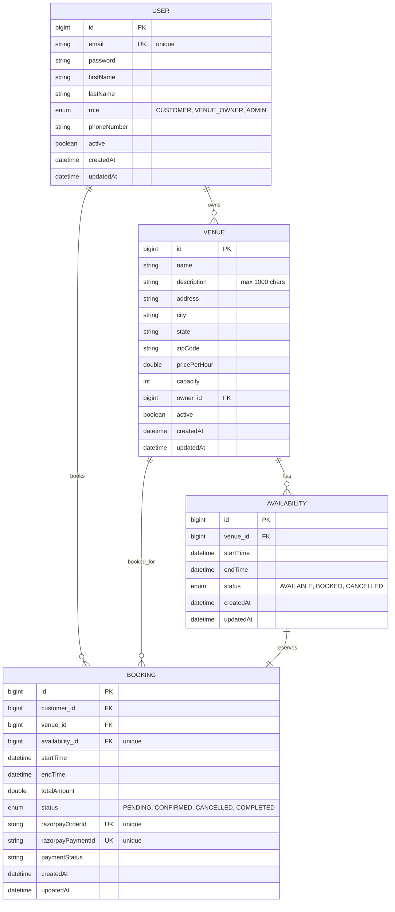

# Entity-Relationship Diagram

## ER Diagram (Mermaid)

## Relationships

1. **USER → VENUE** (One-to-Many)
   - A user (VENUE_OWNER) can own multiple venues
   - A venue belongs to one owner

2. **USER → BOOKING** (One-to-Many)
   - A user (CUSTOMER) can make multiple bookings
   - A booking belongs to one customer

3. **VENUE → AVAILABILITY** (One-to-Many)
   - A venue can have multiple availability slots
   - An availability slot belongs to one venue

4. **VENUE → BOOKING** (One-to-Many)
   - A venue can have multiple bookings
   - A booking is for one venue

5. **AVAILABILITY → BOOKING** (One-to-One)
   - An availability slot can be reserved by one booking
   - A booking reserves one availability slot

## Legend

- **PK** = Primary Key
- **FK** = Foreign Key
- **UK** = Unique Key
- **enum** = Enumeration type
